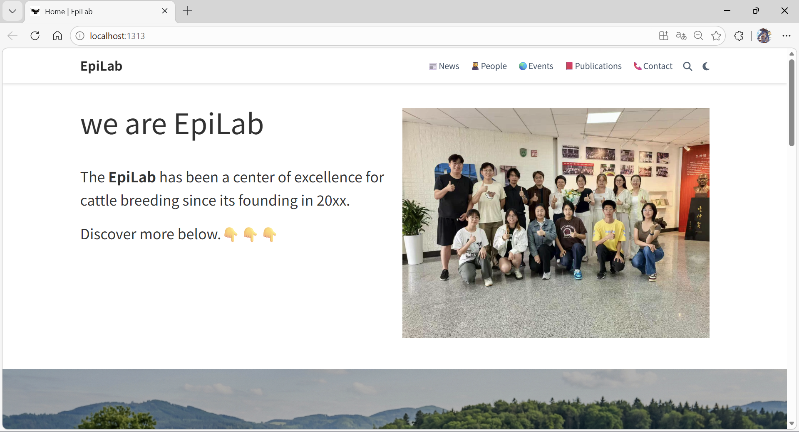
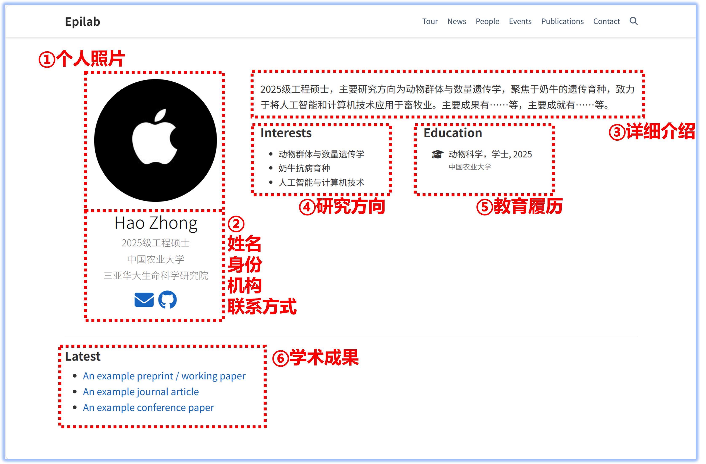

# EPILAB门户网页项目

本项目为[中国农业大学](https://www.cau.edu.cn/)[动物科学技术学院](https://cast1.cau.edu.cn/)动物遗传育种系EPILAB团队的学术网页资源仓库，由团队中Zhong、Chen、Jiang三人进行维护。拟使用的域名为：www.yyEpiLab.cn。

项目基于模板[Hugo Research Group Theme](https://github.com/wowchemy/starter-hugo-research-group)进行构建，通过 GitHub 关联 Netlify 进行全自动构建与部署。





## 项目文件树结构（旧，待更新）

```
.
├── .github # GitHub 平台相关
├── assets 资源与样式
├── config # 站点配置
├── content # 网站的所有展示内容
│   ├── _index.md # 首页
│   ├── admin # 不用管
│   ├── authors # 成员介绍，每人一个文件夹
│   ├── contact # 联系方式
│   ├── event # 活动
│   ├── people # 成员列表
│   ├── news # 动态
│   ├── publication # 学术成果
│   └── (disuse)tour # 项目展示，已整合至首页
├── static # 其他静态资源
├── .gitignore
├── .editorconfig
├── go.mod
├── go.sum
├── LICENSE.md
├── netlify.toml
├── preview.png
├── README.md
└── theme.toml
```

hugo将上述资源构建为`public`h和`resources`文件夹，作为可直接访问的网站本体。

在调试过程中，请始终使用`Hugo server`进行实时调试，以确保网页功能正常。

部分文件可设置为draft（草稿），hugo默认不渲染，此时使用`Hugo server -D`命令渲染草稿，请灵活使用该功能进行调试。

## 本项目用到的工具或软件

维护该项目主要涉及内容编辑、本地预览和自动化部署三个方面。根据项目文件中的配置和脚本，你需要准备以下工具和软件：

1. 本地开发：

- Hugo (Extended版)：用于在本地预览和构建静态文件。
- Go：Hugo的依赖。
- Git & GitHub：代码托管中心。

2. 服务器部署：

- Web 服务器：使用Netlify部署我们的网站，并将我们的域名指向它。

## Issue List/代办项目清单

#### 整体架构

- [ ] 默认语言调整为中文
- [ ] 背景美化
- [ ] 子页面新增banner图（荷斯坦、三河、邓川）
  
- [ ] 顶端导航栏调整：

```
左侧：校徽、院徽、EpiLab图标、yyEpiLab字样；
右侧：
（1）首页
（2）新闻
（3）团队（下拉：教师团队、博士后、博士研究生、硕士研究生、毕业学生）
（4）项目
（5）成果（下拉：论文发表、专利申请、使用工具、成果转换）
（6）加入我们
（7）搜索、日夜模式切换、语言切换
```

- [ ] 首页：

```
（1）介绍大图更换”双甲子“图片，加宽加大，或直接与幻灯片页合并
（2）介绍文本调整至大图下方
（3）幻灯片页：可选（科技小院、乳扇、组会或讨论、细胞间、团建、牛场等）
（4）下方聚合页参考Liu Team
```

- [ ] 新闻：点击进入推文或新闻稿，重点聚合人才强校
- [ ] 团队：同上排列、个人介绍页面信息完善。
- [ ] 项目：排版参考农大主页科学研究部分
- [ ] 成果：点击直接跳转
- [ ] 加入我们：联系功能完善（mail to jjh）

#### 其他

- [ ] Netlify部署及域名指向
- [ ] 信息收集：参考附件1、2
- [ ] 分工：jjh、cht、qwy收集doi（10年内发表）；asy、wyt校对中英文文本
